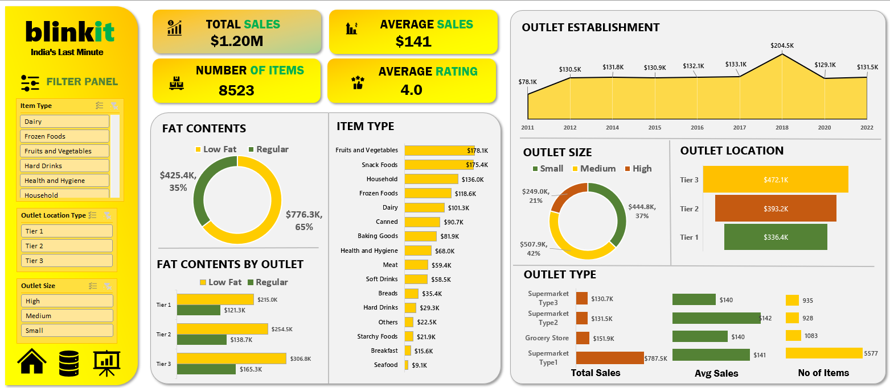

# Retail-Sales-Insights-BlinkIT-Grocery-Data-Analysis-Using-Excel

---

## 🧠 Project Overview
Performed comprehensive Excel-based analysis of BlinkIT’s sales performanxe, customer satisfaction, and inventory distribution to derive actionable insights and optimize business performance

---

## 📂 About the BlinkInt Grocery dataset

  Columns of Dataset include:
  1. Item Fat Content
  2. Item Identifier
  3. Item Type
  4. Outlet Establishment Year
  5. Outlet Identifier
  6. Outlet Location Type
  7. Outlet Size
  8. Outlet Type
  9. Item Visibility
  10. Item Weight
  11. Sales
  12. Rating

Source: https://www.kaggle.com/datasets/swaptr/layoffs-2022](https://www.kaggle.com/datasets/arunkumaroraon/blinkit-grocery-dataset

---

## 🎯 Objectives / Business requirements

- Data cleaning (handling nulls, trimming spaces, standardizing columns, standardizing names)
- total and average sales, number of items, average customer rating
- total sales by fat content, item type, outlet establishment, fat content by Outlet for total sales
- sales by outlet size, outlet location and outlet type
---

## 🛠️ Tools & Techniques

  - Excel
  - Data Cleaning 
  - Exploratory Data and Business Trend Analysis
    
---
## 📸 Dashboard Preview

---
## 🚀 Key Insights

1. **Total Sales Performance:** Overall sales amount to $1.20M, with an average sale value of $141 and an average customer rating of 4.0 across 8,523 items.

2. **Item Category Insights**
    - Fruits & Vegetables and Snack Foods are the top-performing categories, generating $178.1K and $175.4K, respectively.
    - Categories like Seafood and Breakfast have the lowest sales (< $20K), indicating potential areas for promotion or product review.

3. **Fat Content Distribution**
    - Regular fat products (65%) dominate over low-fat products (35%), contributing $776.3K in total sales.
    - Across outlets, Tier 3 outlets show higher sales for both fat content types compared to Tier 1 and Tier 2.

4. **Outlet Size and Location**
    - Medium-sized outlets drive the highest sales ($507.9K,42%) followed by high-sized outlets (37%).
    - Tier 3 locations outperform Tier 1 and Tier 2 with $472.1K in sales, suggesting stronger consumer activity in semi-urban or developing regions.

5. **Outlet Type Insights:**
    - Supermarket Type 1 outlets dominate with $787.5K in sales, accounting for a large share of total revenue.
    - Grocery Stores and other Supermarket types have comparatively modest performance (~$130–150K each).

6. **Sales Over Time**
    - Sales saw a notable peak in 2018 ($204.5K) before stabilizing around $130K per year, showing consistent but plateaued performance post-2019.

*Recommendations: Blinkit’s revenue is largely driven by medium-sized outlets in Tier 3 regions, primarily through regular-fat and high-demand grocery categories such as Fruits & Vegetables and Snack Foods. The Supermarket Type 1 format serves as the most profitable channel. Focused marketing on underperforming categories and continued investment in Tier 3 markets could further elevate overall sales performance..*

